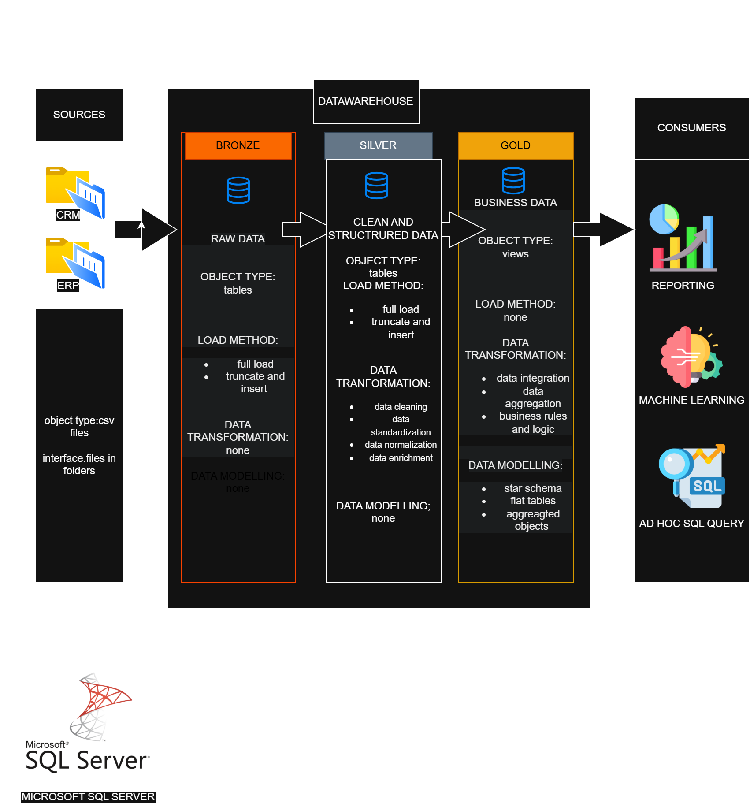

# Data Warehouse and Analytics Project

Welcome to the Data Warehouse and Analytics Project repository! 🚀  
This project demonstrates a comprehensive data warehousing and analytics solution, from building a data warehouse to generating actionable insights. Designed as a portfolio project, it highlights industry best practices in data engineering and analytics.

---

## 🚀 Project Requirements

### Building the Data Warehouse (Data Engineering)

#### Objective
Develop a modern data warehouse using SQL Server to consolidate sales data, enabling analytical reporting and informed decision-making.

#### Specifications
- *Data Sources:* Import data from two source systems (ERP and CRM) provided as CSV files.
- *Data Quality:* Cleanse and resolve data quality issues prior to analysis.
- *Integration:* Combine both sources into a single, user-friendly data model designed for analytical queries.
- *Scope:* Focus on the latest dataset only; historization of data is not required.
- *Documentation:* Provide clear documentation of the data model to support both business stakeholders and analytics teams.

---

### BI: Analytics & Reporting (Data Analytics)

#### Objective
Develop SQL-based analytics to deliver detailed insights into:

- Customer Behavior  
- Product Performance  
- Sales Trends  

These insights empower stakeholders with key business metrics, enabling strategic decision-making.

---
## Data warehouse Architecture
<h2 align="center">🏗️ Data Warehouse Architecture</h2>

  

## 📄 License

This project is licensed under the MIT License. You are free to use, modify, and share this project with proper attribution.

---

## ⭐ About Me

Hi there! I'm Srilatha Kolli, and I'm passionate about data 📊, pipelines, visualization, and generating meaningful insights.  
I enjoy working with data to solve real-world problems and turn raw information into valuable business decisions.
